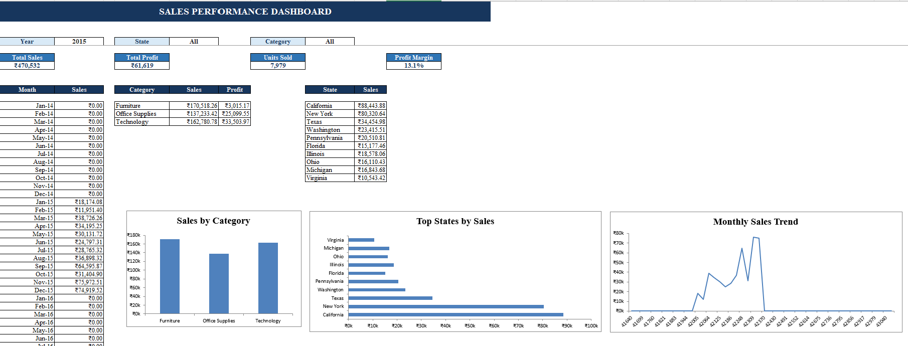

# 📊 Sales Performance Analysis & Interactive Excel Dashboard

## 📌 Project Overview
This project presents an interactive Sales Performance Dashboard developed using Microsoft Excel to analyze sales data and identify key business insights.

The project includes data cleaning, data organization, PivotTables, KPI calculations, charts, and interactive filters to analyze overall sales performance.

## 📊 Dashboard Preview

## 🔍 Key Metrics
- Total Sales
- Total Profit
- Units Sold
- Profit Margin
- Monthly Sales Performance
- Category-wise Performance
- State-wise Sales Performance

## 🛠 Tools & Skills
- Microsoft Excel
- Data Cleaning
- Data Analysis
- PivotTables
- PivotCharts
- Data Visualization
- Dashboard Development

## 📈 Analysis Performed
The dashboard was designed to analyze:

- Sales performance by category
- Top-performing states
- Monthly sales trends
- Overall profitability
- Quantity sold
- Business performance using interactive filters

## 📁 Project Files
- `Project_Sales_Dashboard.xlsx` – Complete Excel project
- `Sales_Performance_Dashboard.png` – Dashboard preview

## 👤 Author
**Indhuraj L**

Data Science & Analytics
